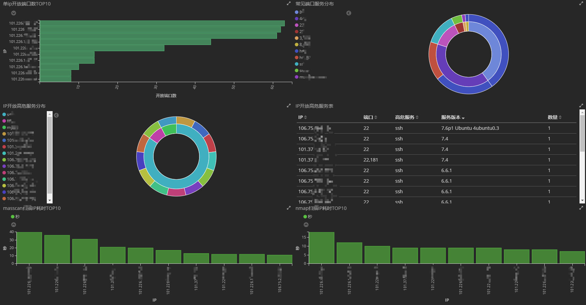

# kibana图表模板
## 模板导入

- 访问`http://xx.xx.xx.xx:5601`（kibana所在ip地址）,左侧菜单单击`Management`，然后选择`Saved Objects`

- 在新出现页面右上角点击`Import`，选择[release](https://github.com/ATpiu/asset-scan/releases)压缩包中的`dashboard.json`，导入dashboard模板。再次点击`Import`，导入压缩包中的`visualize.json`，导入visualize模板。

## 模板Dashboard说明

有了扫描的基础数据，即可通过kibana来自定义各类表盘，为我们安全人员服务，产生价值
在此以模板Dashboard为例，说明上图每个图表作用：
1. 图1：单IP开放端口排序，可以看到前五个外网IP开放端口数明显多于其他几个，一般可能是开启防火墙导致，可添加白名单配置
2. 图2：可查看23、80和3389等常见端口开放的服务
3. 图3和图4：左图可查看作者自定义的高危服务及其IP分布，右图可查看详情并下载CSV表格到本地（滚轮下滑到最底部，单击`RAW`导出CSB格式结果），方便推动攻击面收敛工作
4. 图5和图6：masscan和nmap扫描耗时TOP10，可对扫描时间特别长的IP进行排查，优化扫描策略

**模板Dashboard仅供大家参考学习，具体可根据自己实际需求，在kibana上定制不同的表盘**